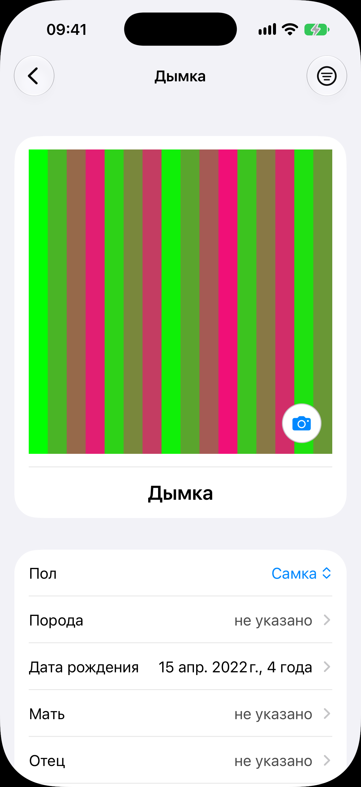
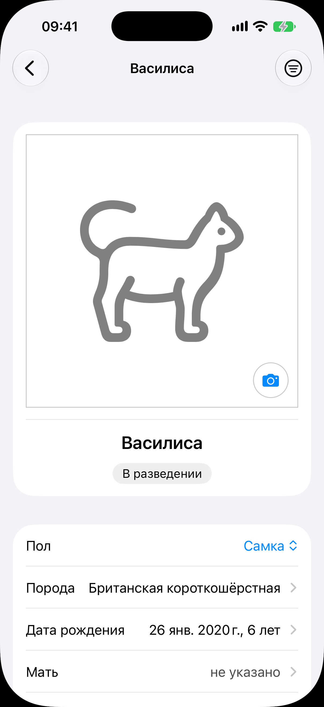
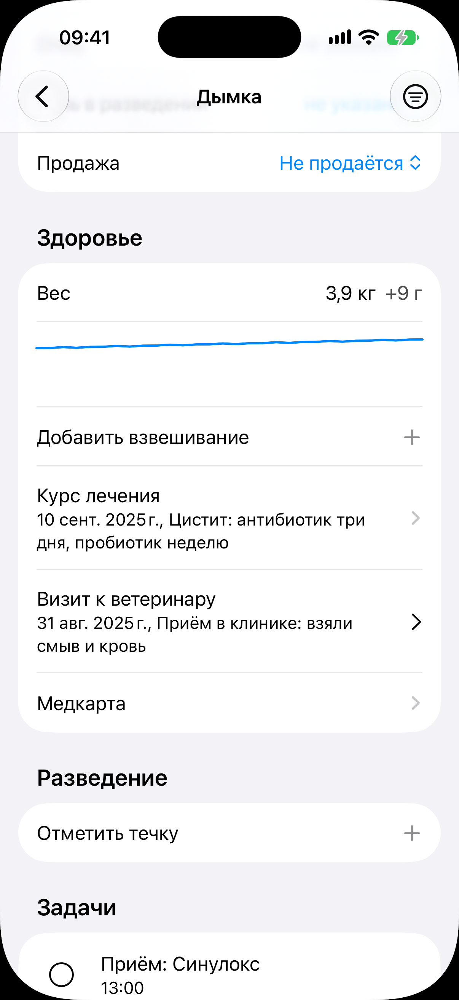
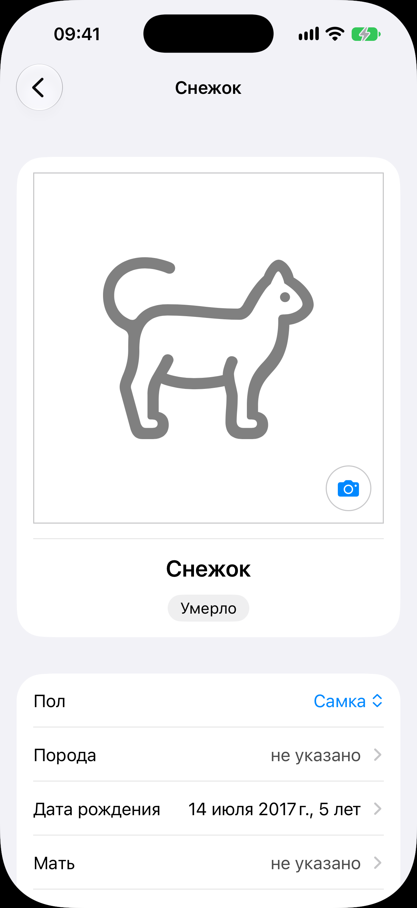
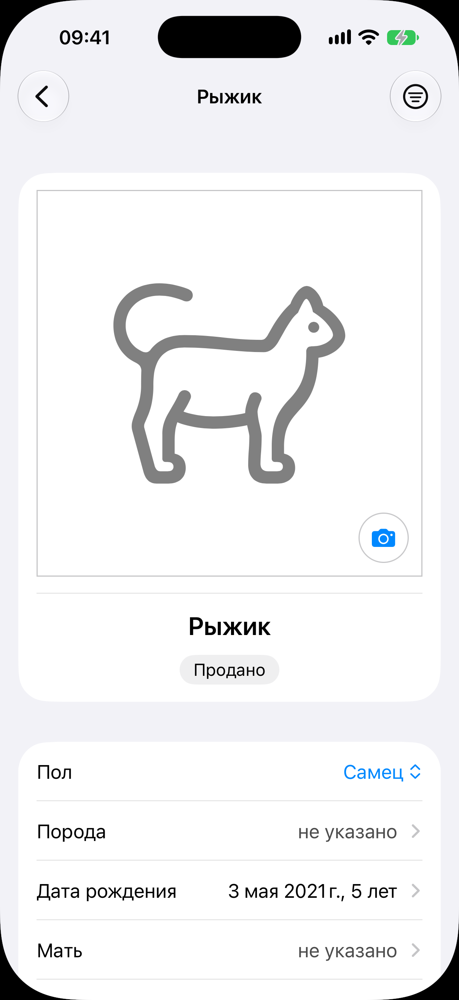
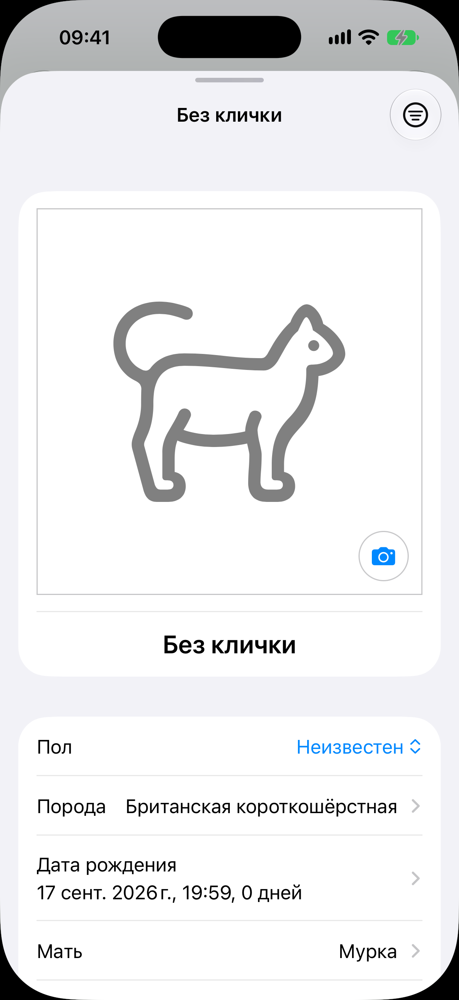

# Карточка животного

Код: `AnimalCardView.swift`, `AnimalPhoto.swift`, `AnimalPhotoMenu.swift`,
`AnimalFieldRow.swift`, `AnimalBadges.swift`, `WeightBlockRows.swift`, `MedicalRow.swift`,
`BreedingRow.swift`, `AnimalTransferSheet.swift`, `AnimalDeathSheet.swift`.

Кадры этого экрана: `animal-card.png`, `animal-card-breeding.png`, `animal-card-health.png`,
`animal-card-deceased.png`, `animal-card-departed.png`, `kitten-card.png`.

## Что это

Главный экран одного животного: и просмотр, и правка на месте, без режима редактирования.
Открывается переходом (шапка «назад», кличка, справа кнопка меню действий), а с экрана родов
листом. Карточка длиннее экрана; на кадрах снят её верх, кроме кадра секции «Здоровье».

Состав сверху вниз:

- блок с фото во всю ширину (кнопка камеры в углу: снять, выбрать из галереи, убрать),
  кличка под ним (тап открывает лист переименования) и плашки статуса: «В разведении»,
  «Умерло», «Продано» и т. п.;
- поля строками: «Пол» (пикер), «Порода», «Дата рождения» с возрастом, «Мать», «Отец»,
  «Роль в разведении» (пикер), «Продажа» (пикер коммерческого статуса); пустое поле
  показано приглушённым «не указано»; строки со стрелкой ведут на свой экран ввода; у
  котёнка ещё переключатель витальности и строка «Помёт»;
- секция «Здоровье»: блок веса (последний вес, прибавка, кривая, «Добавить взвешивание»),
  две последние записи медкарты и переход «Медкарта»;
- секция «Разведение» (у самок): последние три записи истории, приглашение «Завести
  беременность» под вязкой без беременности, «Отметить течку», переход «Вся история
  разведения»;
- секция «Задачи» этого животного: строки дел с кругом отметки, как в ленте «Сегодня»;
- строка дежурства: «Дежурство идёт» или «Включить наблюдение»;
- действия: «Передать», «Отметить смерть», «Вернуть в питомник» (у выбывшего), «Завести
  вязку», «Отметить беременность», «Завести помёт», «Удалить животное».

## Что делает пользователь

- Смотрит и правит всё про животное: поля тапом, фото камерой.
- Быстро видит вес и последние медицинские события, добавляет взвешивание одним тапом.
- Ведёт цикл разведения самки: течки, вязки, беременность, история.
- Совершает событие жизни: продажа или передача, смерть, роды, возврат в питомник.

## Откуда открывается

- Строка в [списке животных](../animals/animals.md).
- Строка котёнка в [карточке помёта](../litter/litter.md): переходом.
- Строка котёнка на [экране родов](../birth/birth.md): листом.
- Поля «Мать» и «Отец» другого животного.

## Куда ведёт

- «Порода», «Дата рождения», «Мать», «Отец»: экраны ввода переходом.
- «Медкарта»: [медкарта](../medical-record/medical-record.md); запись курса: [курс лечения](../treatment/treatment.md);
  другие записи: лист записи; «Добавить взвешивание»: лист взвешивания.
- «Вся история разведения»: [история разведения](../breeding-history/breeding-history.md); строка
  беременности: [беременность](../pregnancy/pregnancy.md); строка течки или вязки: лист правки записи;
  «Завести вязку»: [форма вязки](../mating-form/mating-form.md); «Отметить течку»: лист течки.
- «Отметить беременность»: лист выбора якоря (тот же, что в [онбординге](../onboarding/onboarding.md)),
  затем [беременность](../pregnancy/pregnancy.md).
- «Завести помёт»: [экран родов](../birth/birth.md) на весь экран.
- «Включить наблюдение»: [включение дежурства](../duty/duty.md); «Дежурство идёт»: идущее
  дежурство там же.
- «Передать»: лист передачи (дата, кому, статус: продано, передано, в аренду). «Отметить
  смерть»: лист с датой. «Удалить животное»: подтверждение с перечнем того, что уйдёт.
- Строка «Помёт» у котёнка: [карточка помёта](../litter/litter.md).
- Строки задач: как в [ленте дел](../today/today.md).

## Состояния

### Животное с фото и пустыми полями

Кошка Дымка: фото во всю ширину, кнопка камеры в углу, кличка под фото, плашек нет. Порода,
мать и отец пусты и показаны приглушённым «не указано»; дата рождения заполнена и рядом
возраст.

### Самка в разведении

Кошка Василиса: фото нет, на его месте силуэт; под кличкой плашка «В разведении». Поля
заполнены: пол «Самка», порода из реестра, дата рождения. Ниже сгиба у этой карточки
секция «Разведение» с пятью записями (обрезаны до трёх), строкой «Отметить течку» и
переходом «Вся история разведения».

### Секция «Здоровье»

Карточка Дымки, прокрученная ниже полей. Сверху хвост полей: «Продажа» с пикером «Не
продаётся». Секция «Здоровье»: вес «3,9 кг» с прибавкой «+9 г», кривая веса, «Добавить
взвешивание», две последние записи медкарты («Курс лечения» со стрелкой на экран курса,
«Визит к ветеринару», открывающий лист) и переход «Медкарта». Ниже секция «Разведение» со
строкой «Отметить течку» и начало секции «Задачи».

### Умершее животное

Кошка Снежок с плашкой «Умерло». Плашка роли гаснет, хотя роль в полях остаётся; возраст
посчитан на дату смерти. В шапке нет кнопки меню. Из действий остаются «Передать» и
«Отметить смерть»: тот же лист с той же датой чинит ошибочную отметку. Разведение и
дежурство недоступны.

### Выбывшее животное

Кот Рыжик, проданный из питомника: плашка «Продано». Поля открыты и правятся. Из действий
«Передать» пропадает, вместо него встаёт «Вернуть в питомник».

### Карточка котёнка листом

Та же карточка, поднятая листом над экраном родов: полоска перетаскивания сверху, своя
шапка с отображаемым именем «Без клички» и кнопкой меню. Порода унаследована от матери,
дата рождения с временем и возрастом в днях, мать заполнена автоматически. Ниже сгиба
переключатель витальности (живой или мёртворождённый) и строка «Помёт».
