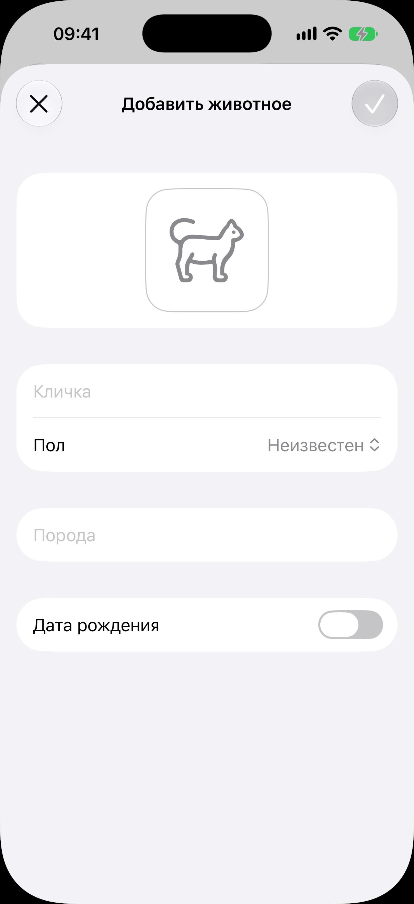

# Форма нового животного

Код: `AnimalFormView.swift`, `AnimalPhotoField.swift`, `AnimalBreedInput.swift`,
`AnimalBornAtInput.swift`.

Кадры этого экрана: `animal-new.png`. Та же форма в онбординге: `onboarding-animal.png`
(описана в [флоу первого запуска](../onboarding/onboarding.md)).

## Что это

Лист «Добавить животное». В шапке крестик слева и галочка справа; галочка погашена, пока
кличка пуста. Сверху место под фото с силуэтом кошки (тап открывает меню: снять камерой или
выбрать из галереи). Поля: «Кличка», «Пол» (пикер: неизвестен, самка, самец), «Порода»
(текст с подсказками из реестра пород), переключатель «Дата рождения» (включённый
раскрывает выбор даты).

## Что делает пользователь

Заводит животное минимальным набором: достаточно клички. Всё остальное дозаполняется потом
в карточке. Галочка сохраняет и закрывает лист, крестик закрывает без сохранения.

## Откуда открывается

- Плюс в шапке [списка животных](../animals/animals.md).
- Первым шагом [онбординга](../onboarding/onboarding.md), со строкой-объяснением над полями.

## Куда ведёт

- Галочка: животное появляется в [списке](../animals/animals.md); в онбординге ведёт на развилку.
- Место под фото: системная камера или выбор из галереи.

## Состояния

### Нетронутая форма из списка

Форма сразу после открытия: кличка пустая, галочка погашена, пол «Неизвестен», дата
рождения выключена.
