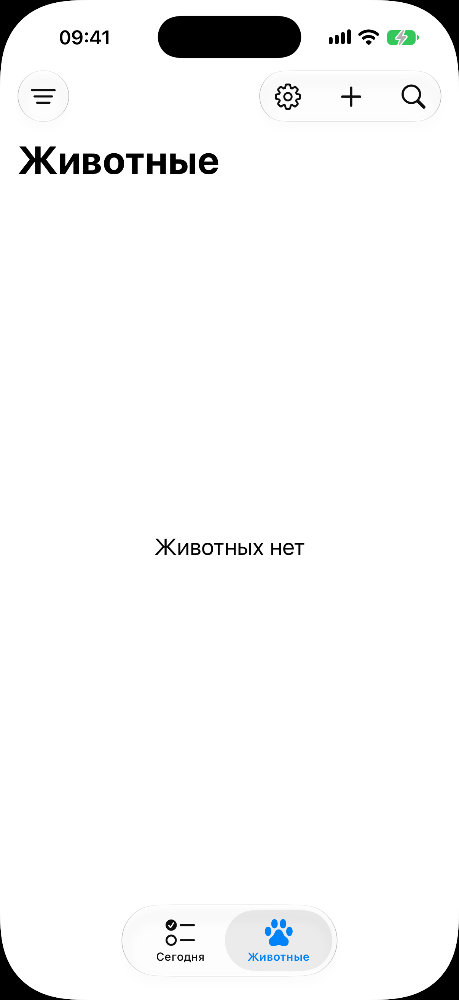
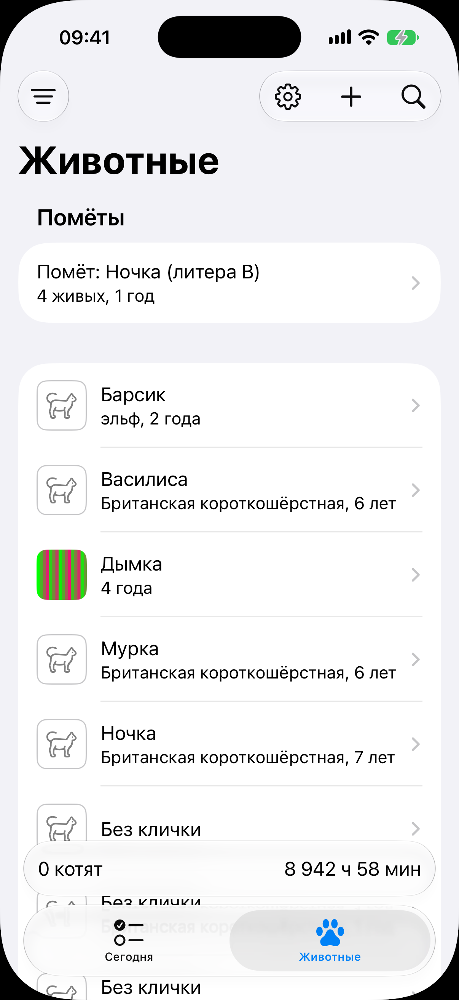

# Вкладка «Животные»

Код: `AnimalsView.swift`, `AnimalRow.swift`, `LitterRow.swift`.

Кадры этого экрана: `animals-empty.png`, `animals-list.png`.

## Что это

Вторая вкладка корня: список питомника. Шапка: слева кнопка фильтра (меню с переключателем
«Умершие и выбывшие»), справа шестерёнка настроек, плюс «Добавить животное» и лупа поиска.
Крупный заголовок «Животные».

Состав списка:

- секция «Помёты»: по строке на помёт в выращивании, с названием («Помёт: Ночка (литера
  B)»), числом живых котят и возрастом; закрытых помётов здесь нет;
- все животные одной группой: миниатюра фото или силуэт кошки, кличка (или «Без клички»),
  порода и возраст; животные без клички идут в конце; умершие и выбывшие скрыты, пока не
  включён фильтр.

Над таб-баром может стоять полоса родов, общая для обеих вкладок (см. [«Сегодня»](../today/today.md)).

## Что делает пользователь

- Находит животное (глазами или лупой) и открывает карточку.
- Открывает помёт из секции сверху.
- Заводит новое животное плюсом.

## Откуда открывается

- Таб-бар, вкладка «Животные».
- Сюда высаживает [флоу первого запуска](../onboarding/onboarding.md) по кнопке «Готово».
- Кнопка «назад» из карточек животных и помётов.

## Куда ведёт

- Строка животного: [карточка животного](../animal-card/animal-card.md).
- Строка помёта: [карточка помёта](../litter/litter.md).
- Плюс: [форма нового животного](../animal-form/animal-form.md) листом.
- Шестерёнка: [настройки](../settings/settings.md) листом.
- Полоса родов: [экран родов](../birth/birth.md).

## Состояния

### Пустой список

Питомник без единого животного: посередине надпись «Животных нет». Полосы родов нет.

### Список питомника

Наполненный питомник: сверху секция «Помёты» с одним помётом, ниже животные. В списке рядом
стоят порода из реестра («Британская короткошёрстная»), порода, вписанная руками («эльф»),
животное с фото (миниатюра вместо силуэта) и животные без клички. Внизу полоса родов
«0 котят» и время от начала.
