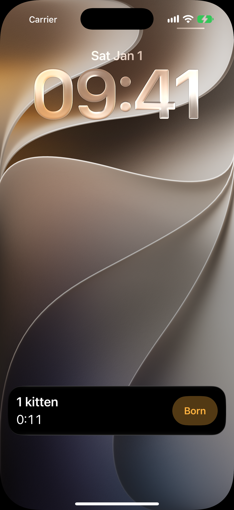
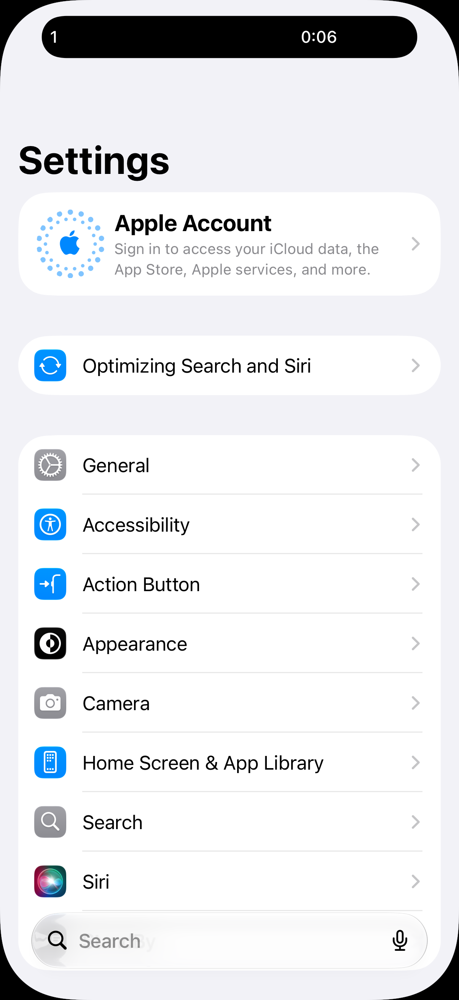
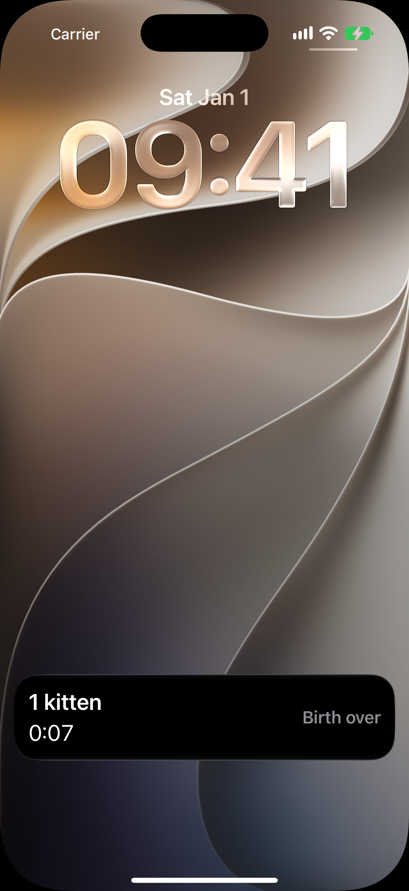

# Живая активность родов

Код: `BreedlyWidgets/BirthCard.swift`, `SystemBirthActivityPresenter.swift`,
`Packages/BreedlyKit/Sources/BreedlyIntents/BornIntent.swift`.

Кадры: `birth-activity-card.png`, `birth-activity-island.png`, `birth-activity-summary.png`.

## Что это

Системные поверхности, а не экраны приложения: живая активность, которая появляется вместе
с сессией родов и живёт до её конца на экране блокировки, в Центре уведомлений и в Dynamic
Island. Язык на кадрах английский: локаль виджета в съёмке не переключается.

- Карточка на локскрине: слева крупно число котят и бегущее время от начала родов, справа
  янтарная кнопка «Born».
- Компактный вид в Dynamic Island: число котят слева, время справа; долгое нажатие
  раскрывает вид с кнопкой.
- После конца родов карточка остаётся сводкой: время остановлено, вместо кнопки слово
  «Birth over».

## Что делает пользователь

Не разблокируя телефон и не открывая приложение, записывает котёнка кнопкой «Born» (App
Intent пишет в базу напрямую), следит за временем, возвращается в журнал одним тапом.

## Откуда открывается

Появляется сама, когда на [экране родов](../birth/birth.md) открыта сессия; компактный вид, когда
приложение ушло в фон.

## Куда ведёт

- Тап по карточке или пилюле: [экран родов](../birth/birth.md) в приложении; после конца родов
  завершённый журнал.
- «Born»: запись котёнка на месте, число обновляется.

## Состояния

### Карточка на экране блокировки

Идущие роды: «1 kitten», таймер «0:10», кнопка «Born». Снято через Центр уведомлений,
который рисует ту же презентацию, что и локскрин.

### Dynamic Island

Приложение в фоне, поверх открыты системные Настройки (к Breedly не относятся). В чёрной
пилюле слева «1», справа «0:06».

### Сводка после конца родов

Та же карточка после завершения: время остановлено на «0:08», на месте кнопки «Birth
over». Остаётся на локскрине некоторое время и уходит сама.
