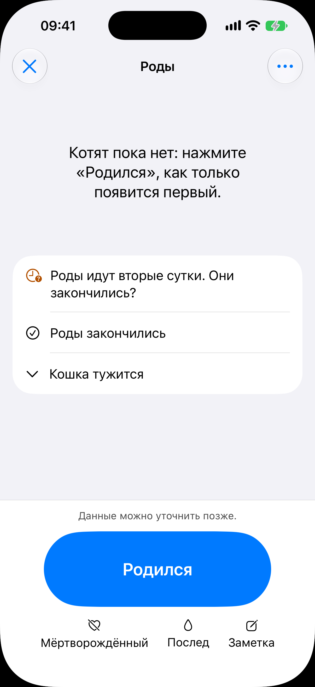
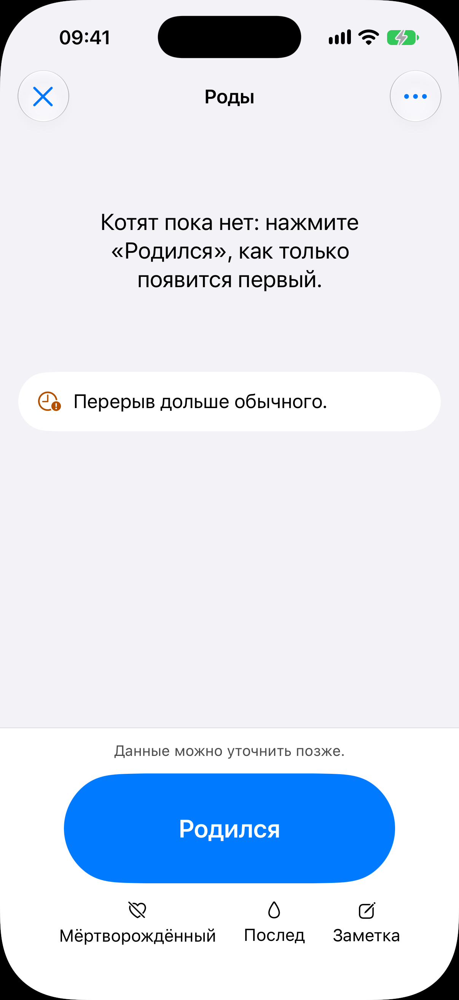
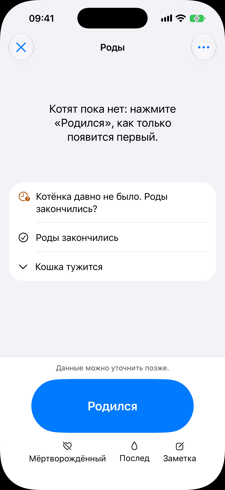
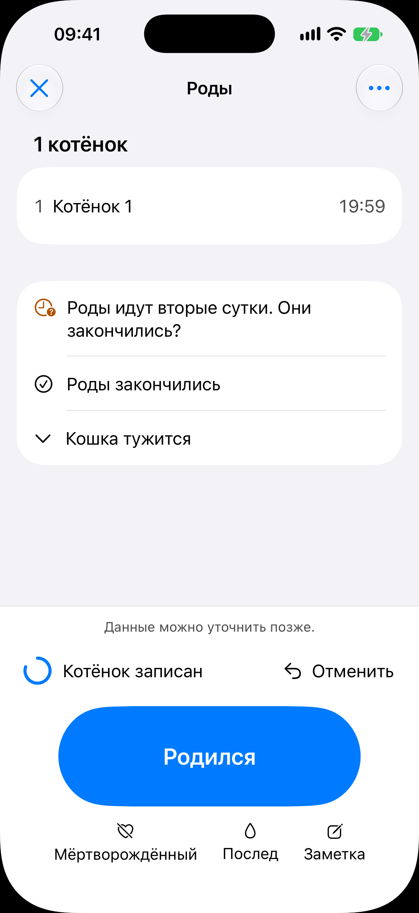
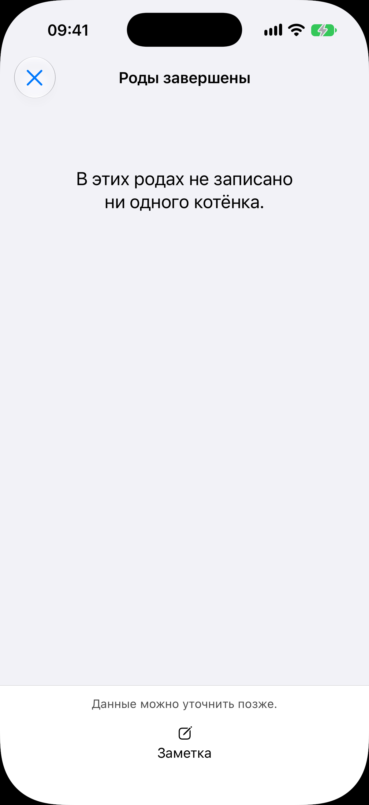

# Экран родов

Код: `BirthView.swift`, `BirthRow.swift`, `BirthPromptSection.swift`, `BirthQuickActions.swift`,
`BirthUndoBar.swift`, `BirthNoteSheet.swift`, `BirthFinishSheet.swift`.

Кадры этого экрана: `birth.png`, `birth-mark.png`, `birth-prompt.png`, `birth-undo.png`,
`birth-finished.png`.

## Что это

Герой продукта: журнал родов одного помёта. Пока сессия жива, показывается на весь экран
поверх корня, без таб-бара; завершённый журнал открывается обычным переходом из карточки
помёта. Экран смотрят ночью, одной рукой, с занятыми руками; в тёмной теме акцент меняется
на янтарный, а светлые плоскости уходят (кадров тёмной темы в наборе нет).

Состав сверху вниз:

- шапка «Роды» (или «Роды завершены»): слева крестик «закрыть» (сессия не завершается, а
  скрывается), справа кнопка «Ещё» с меню, в котором «Завершить роды»;
- список записанных котят: номер, имя, время рождения; тап открывает карточку котёнка
  листом; пока котят нет, стоит подсказка «Котят пока нет: нажмите „Родился“, как только
  появится первый»;
- конец ленты: тихая пометка о долгом перерыве или развилка с вопросом, закончились ли
  роды (по суткам от начала или по перерыву между котятами);
- панель захвата внизу: подпись «Данные можно уточнить позже», полоса отмены после
  записи, крупная главная кнопка «Родился» и три быстрых действия: «Мёртворождённый»,
  «Послед», «Заметка».

## Что делает пользователь

Одним тапом фиксирует каждого котёнка в момент рождения, отмечает мёртворождённых и
последы, пишет заметки, отменяет случайный тап, отвечает на вопрос о конце родов,
завершает сессию, позже дописывает котятам данные.

## Откуда открывается

- Полоса родов над таб-баром на любой вкладке ([«Сегодня»](../today/today.md), [«Животные»](../animals/animals.md)).
- [Живая активность](../birth-activity/birth-activity.md) на локскрине и в Dynamic Island.
- «Открыть роды» и «Котята родились» на [экране беременности](../pregnancy/pregnancy.md).
- «Завести помёт» в [карточке самки](../animal-card/animal-card.md).
- Холодный запуск при живой сессии открывает роды сразу.
- Секция «Роды» в [карточке помёта](../litter/litter.md): переходом, обычно уже завершённый журнал.

## Куда ведёт

- «Родился», «Мёртворождённый», «Послед»: запись и полоса отмены.
- Строка котёнка: [карточка котёнка листом](../animal-card/animal-card.md).
- «Заметка»: лист заметки о помёте.
- «Роды закончились» и «Завершить роды»: лист завершения (время конца), после него режим
  «Роды завершены».
- Крестик: назад к корню, полоса родов остаётся.

## Состояния

### Открытая сессия без котят, развилка по суткам

Список пуст, стоит подсказка. Развилка «Роды идут вторые сутки. Они закончились?» с
ответами «Роды закончились» (галочка) и «Кошка тужится» (стрелка вниз, сворачивает вопрос).
Внизу панель захвата с кнопкой «Родился» и тремя быстрыми действиями.

### Тихая пометка

Первая ступень тревоги: вместо развилки строка «Перерыв дольше обычного.» с оранжевым
значком часов. Обозначена и цветом, и символом. Действий у пометки нет.

### Развилка по перерыву

Вторая ступень: «Котёнка давно не было. Роды закончились?» с теми же двумя ответами.
Слова другие, место то же. Под ней остаётся место до кнопки «Родился».

### Полоса отмены после записи

Сразу после «Родился»: в списке «1 котёнок» и строка «Котёнок 1» со временем; над главной
кнопкой полоса отмены с кольцом обратного отсчёта, словами «Котёнок записан» и кнопкой
«Отменить». Живёт несколько секунд; панель сдвигается вверх, лента не перекрывается.

### Роды завершены

Второй режим экрана. Шапка «Роды завершены», кнопки «Ещё» нет. Кнопки «Родился» и развилки
нет, из панели остаётся только «Заметка». Список котят тот же и правится тапом; здесь он
пуст, надпись «В этих родах не записано ни одного котёнка».
