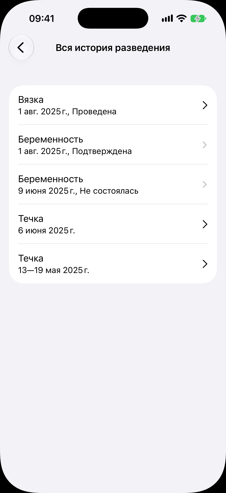

# Вся история разведения

Код: `BreedingHistoryView.swift`, `BreedingRow.swift`, `AnimalHeatSheet.swift`.

Кадры этого экрана: `breeding-history.png`.

## Что это

Экран полной истории одной самки, открытый переходом с карточки. Одна группа строк, новые
сверху. Каждая строка: вид записи первой строкой («Вязка», «Беременность», «Течка»,
«Помёт») и дата с исходом второй: у течки её даты, у вязки стадия («Проведена»), у
беременности статус («Подтверждена», «Не состоялась»), у помёта число котят. Стрелка
справа яркая у строк, открывающих лист правки, и приглушённая у строк, ведущих на экран.

## Что делает пользователь

Смотрит полный цикл кошки, открывает любую запись, чтобы поправить или перейти к
беременности и помёту.

## Откуда открывается

Переход «Вся история разведения» в секции «Разведение» [карточки самки](../animal-card/animal-card.md).

## Куда ведёт

- Течка: лист течки (даты начала и конца, удаление).
- Вязка: [форма вязки](../mating-form/mating-form.md), заполненная.
- Беременность: [экран беременности](../pregnancy/pregnancy.md).
- Помёт: [карточка помёта](../litter/litter.md).

## Состояния

### Лента из пяти записей

Кошка с двумя течками, вязкой и двумя беременностями, живой и несостоявшейся. Помёта нет.
Без записей экран показал бы «Записей о разведении нет», но переход с карточки в этом
случае и не показывается.
