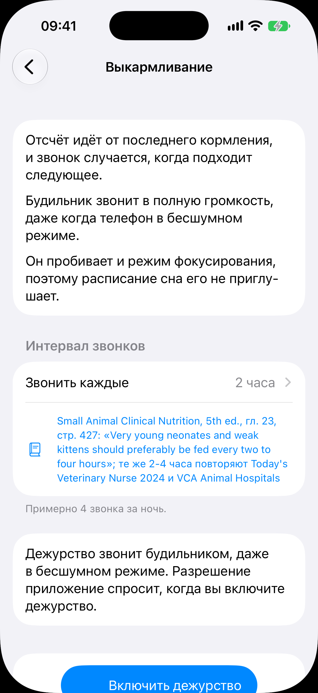
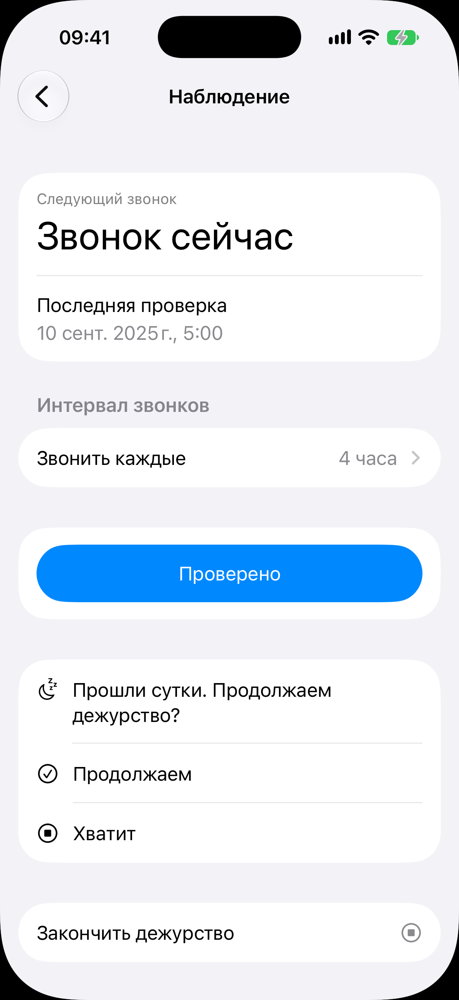

# Дежурство

Код: `DutyStartView.swift`, `DutyView.swift`, `DutyPromptSection.swift`,
`DutyShorteningSection.swift`, `AlarmPermissionRow.swift`, `DutyDeedIntent.swift`.

Кадры: `duty-start.png` (включение), `duty.png` (идущее дежурство).

## Что это

Дежурство - ночная вахта с будильником, который звонит через заданный интервал в полную
громкость, даже в бесшумном режиме и сквозь режим фокусирования. Два вида: «Выкармливание»
(слабых котят кормят каждые 2-4 часа) и «Наблюдение» (за животным). У дежурства два
экрана, оба открываются переходом.

**Включение.** Заголовок называет вид. Сверху согласие в три абзаца: отсчёт идёт от
последнего кормления, будильник не заглушить, он пробивает режим фокусирования. Секция
«Интервал звонков»: строка «Звонить каждые» (пикер переходом, предзаполнен из справочника) и
ссылка на источник числа; подпись «Примерно N звонков за ночь». Строка разрешения на
будильники: спросится по кнопке. Внизу крупная кнопка «Включить дежурство».

**Идущее дежурство.** Блок «Следующий звонок»: крупно остаток времени или «Звонок сейчас»,
ниже «Последняя проверка» с датой и временем. Секция «Интервал звонков» с переходом.
Крупная кнопка «Проверено» (у выкармливания «Покормлено»): фиксирует действие и
переставляет следующий звонок. Раз в сутки созревает вопрос «Прошли сутки. Продолжаем
дежурство?» с ответами «Продолжаем» и «Хватит»; у выкармливания к ним добавляется
предложение перейти на редкое кормление со ссылкой на источник. Внизу действие «Закончить
дежурство».

## Что делает пользователь

Осознанно решает разрушить себе сон, выбирает интервал, включает дежурство. Ночью по
звонку кормит или проверяет и жмёт одну кнопку; раз в сутки отвечает, продолжать ли;
заканчивает, когда вахта больше не нужна.

## Откуда открывается

- «Включить дежурство» внизу [карточки помёта](../litter/litter.md) и предложение выкармливания, когда
  мать умерла.
- «Включить наблюдение» в [карточке животного](../animal-card/animal-card.md).
- Идущее: строка в секции «Идёт» на вкладке [«Сегодня»](../today/today.md), строка «Дежурство идёт» в
  карточках, тап по будильнику системы.

## Куда ведёт

- «Включить дежурство»: идущее дежурство (системный диалог разрешения по пути).
- «Хватит» и «Закончить дежурство»: дежурство закрывается, возврат назад.
- «Звонить каждые»: список интервалов. Источник: внешняя страница.

## Состояния

### Включение выкармливания

Согласие целиком, «Звонить каждые, 2 часа» с цитатой из справочника, «Примерно 4 звонка за
ночь», строка разрешения и кнопка «Включить дежурство» у нижнего края. Без чисел справочника
кнопка погашена и стоит подпись «Чисел интервала нет, дежурство не запустить».

### Идущее наблюдение с созревшим вопросом

«Звонок сейчас» (срок звонка наступил), «Последняя проверка» с датой, интервал «4 часа»,
кнопка «Проверено», вопрос «Прошли сутки. Продолжаем дежурство?» с двумя ответами и
действие «Закончить дежурство». До созревания вопроса его секции нет, а вместо «Звонок
сейчас» идёт отсчёт.
