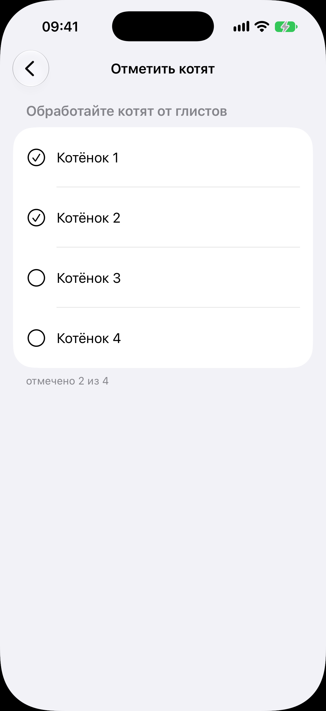

# Отметить котят

Код: `KittenMarksView.swift`, `KittenMarkList.swift`.

Кадры этого экрана: `kitten-marks.png`.

## Что это

Экран покотятных отметок одного пункта выращивания, открытый переходом. Шапка «Отметить
котят», под ней приглушённый заголовок пункта («Обработайте котят от глистов»). Список
котят в порядке рождения с кругами: отмеченные с галочкой, неотмеченные пустые. Под
списком счётчик «отмечено 2 из 4».

## Что делает пользователь

Отмечает пункт по каждому котёнку отдельно: кого уже проглистогонил, а кого ещё нет. Тап
по строке ставит или снимает отметку.

## Откуда открывается

Кнопка «Отметить котят» в пункте ленты выращивания на [карточке помёта](../litter/litter.md),
адресованном каждому котёнку.

## Куда ведёт

- «Назад»: обратно на [карточку помёта](../litter/litter.md); счётчик в пункте ленты обновляется.

## Состояния

### Половина списка отмечена

Два отмеченных и два пустых круга рядом. Помёт без своих котят показал бы «В этом помёте
некого отмечать».
