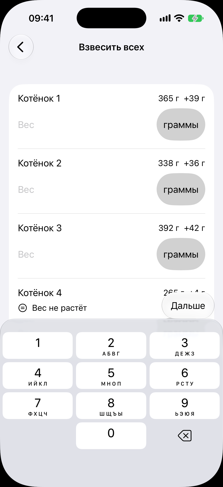

# Взвесить всех

Код: `LitterWeighingView.swift`, `WeightGainHighlightText.swift`, `WeightInputUnitText.swift`.

Кадры этого экрана: `litter-weighing.png`.

## Что это

Экран группового взвешивания помёта, открытый переходом с карточки; цифровая клавиатура
поднята сразу. Список котят строго в порядке рождения, не переставляется ни при каком
условии: заводчик кладёт котят на весы по памяти. У каждого: имя, справа прошлый вес и
прибавка («365 г, +39 г»), под ними поле «Вес» с кнопкой единицы («граммы», тап
переключает на килограммы). У котёнка, чей вес встал, подсветка «Вес не растёт» со
значком. Над клавиатурой кнопка «Дальше» переводит фокус на следующего котёнка.

## Что делает пользователь

Взвешивает весь помёт за один заход, вводя числа подряд; каждое введённое сохраняется как
взвешивание котёнка. Это главный ежедневный ритуал первых недель.

## Откуда открывается

Строка «Взвесить всех» на [карточке помёта](../litter/litter.md).

## Куда ведёт

- «Назад»: обратно на [карточку помёта](../litter/litter.md), подпись под «Взвесить всех» меняется на
  «Взвешивали сегодня».

## Состояния

### Помёт из четырёх котят, у одного вес встал

Три котёнка с прибавкой, у четвёртого подсветка «Вес не растёт». Пустой помёт показал бы
надпись «Некого взвешивать».
