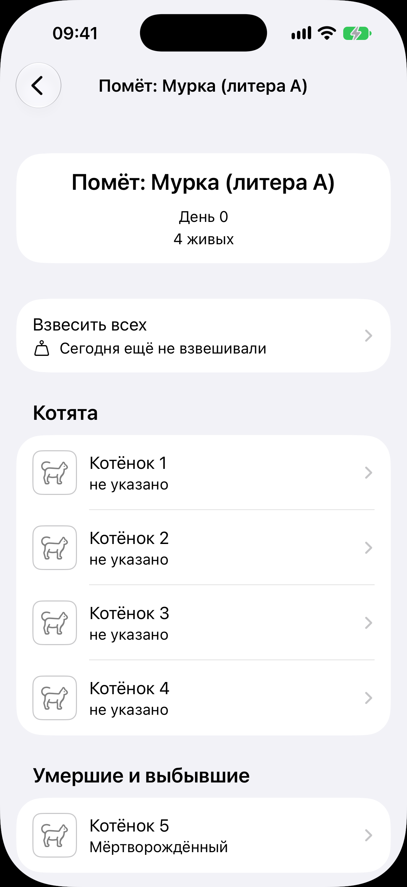
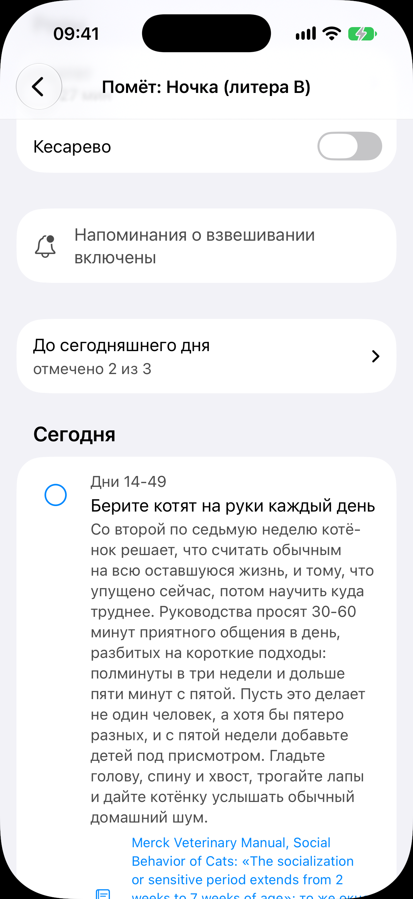
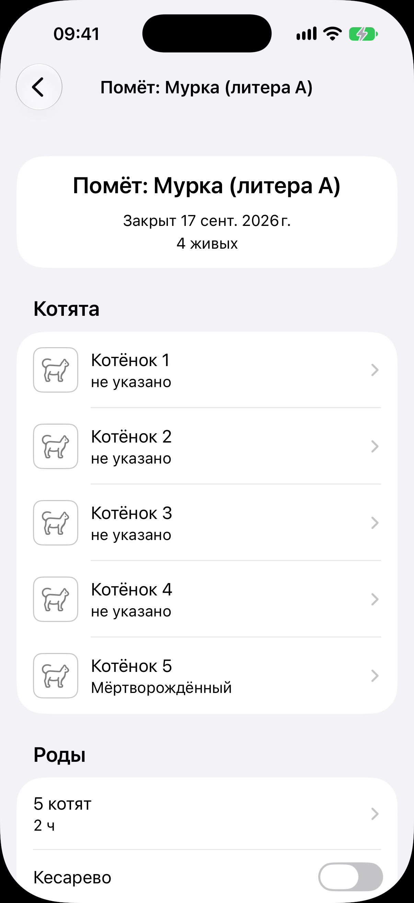

# Карточка помёта

Код: `LitterCardView.swift`, `KittenRow.swift`, `LitterNameText.swift`,
`TimelineFeedSection.swift`, `TimelineRow.swift`.

Кадры этого экрана: `litter.png`, `rearing-timeline.png`, `litter-closed.png`.

## Что это

Экран одного помёта от родов до передачи котят, открытый переходом. Шапка «назад» и
название помёта («Помёт: Мурка (литера A)»). Карточка длиннее экрана.

Состав сверху вниз:

- заголовочный блок: название, «День N» выращивания (у закрытого «Закрыт» с датой), число
  живых котят;
- строка «Взвесить всех» с подписью, взвешивали ли сегодня (только у помёта в выращивании);
- секция «Котята»: живые котята в порядке рождения, у каждого силуэт, имя, вторая строка
  (пол или «не указано»); секция «Умершие и выбывшие» показывается, только если непуста;
  у закрытого помёта все котята одним списком со своими исходами;
- секция «Роды»: число котят и длительность со стрелкой в журнал, переключатели
  «Кесарево» и «Ранние роды»;
- строка напоминаний о взвешивании: действие «Включить напоминания о взвешивании» или
  пометка «включены»;
- если мать умерла, предложение включить выкармливание с кнопкой «Не нужно»; если у
  котёнка встал вес, строка «Кормите чаще, когда вес не растёт»;
- лента выращивания: тот же компонент, что у беременности, с якорем от даты рождения;
  у пунктов, адресованных каждому котёнку, вместо круга кнопка «Отметить котят»; лента
  кончается днём передачи котят, который задаёт федерация из настроек;
- строка дежурства: «Дежурство идёт» или «Включить дежурство»;
- действия: «Закрыть помёт», «Добавить котёнка», «Удалить помёт» (у закрытого только
  удаление).

## Что делает пользователь

Ведёт помёт: взвешивает, читает рекомендации по дням, отмечает сделанное по помёту или по
каждому котёнку, ставит напоминания, включает дежурство, закрывает помёт, когда все
переданы, потом смотрит архив.

## Откуда открывается

- Секция «Помёты» в [списке животных](../animals/animals.md).
- Секция «Идёт» на вкладке [«Сегодня»](../today/today.md).
- «Перейти к помёту» на [экране беременности](../pregnancy/pregnancy.md).
- Строка «Помёт» в [карточке котёнка](../animal-card/animal-card.md), строка помёта в
  [истории разведения](../breeding-history/breeding-history.md).
- Сразу после «Добавить помёт» в [онбординге](../onboarding/onboarding.md).

## Куда ведёт

- «Взвесить всех»: [групповое взвешивание](../litter-weighing/litter-weighing.md).
- Строка котёнка: [карточка котёнка](../animal-card/animal-card.md) переходом.
- Секция «Роды»: [журнал родов](../birth/birth.md) переходом.
- «Отметить котят»: [покотятные отметки](../kitten-marks/kitten-marks.md).
- «Напомнить» в пункте: задача в [ленте дел](../today/today.md). Источник: внешняя страница.
- «Включить дежурство» и «Дежурство идёт»: [дежурство](../duty/duty.md).
- «Закрыть помёт»: закрытое состояние. «Добавить котёнка»: заводит котёнка и открывает
  его карточку. «Удалить помёт»: подтверждение (журнал и заметки уходят вместе с ним).

## Состояния

### Помёт в выращивании, верх карточки

«День 0», «4 живых». Строка «Взвесить всех» с подписью «Сегодня ещё не взвешивали».
Четыре живых котёнка в секции «Котята», мёртворождённый «Котёнок 5» в секции «Умершие и
выбывшие».

### Лента выращивания

Другой помёт, карточка прокручена ниже блока родов. Сверху хвост секции «Роды»
(«Кесарево»), строка «Напоминания о взвешивании включены», свёрнутое прошлое «отмечено 2
из 3», заголовок «Сегодня» и раскрытый пункт «Дни 14-49. Берите котят на руки каждый день»
с длинным текстом и ссылкой на источник. Кнопка «Напомнить» ушла ниже сгиба.

### Закрытый помёт

«Закрыт 17 сент. 2026 г.», строки «Взвесить всех» нет. Все пять котят одним списком с
исходами («не указано», «Мёртворождённый»). Секция «Роды» на месте: «5 котят», «2 ч»,
«Кесарево». Ленты, дежурства и напоминаний нет; из действий остаётся «Удалить помёт».
