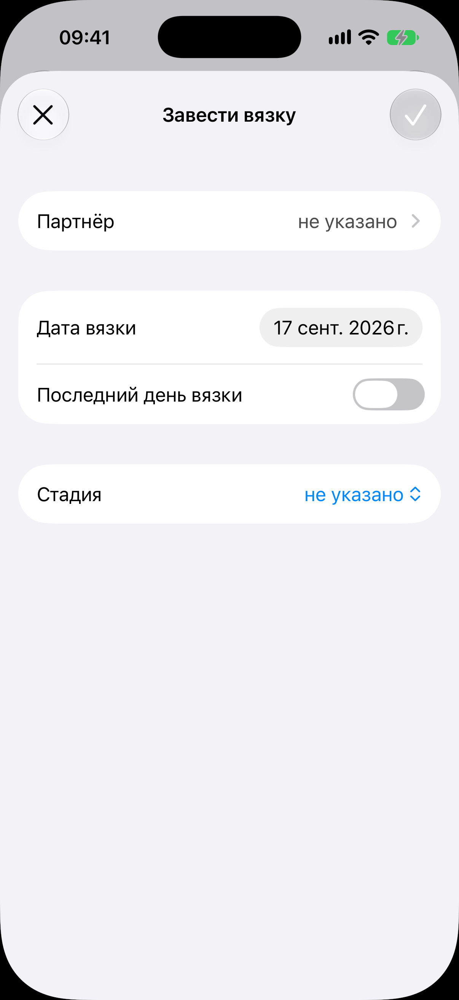

# Форма вязки

Код: `AnimalMatingSheet.swift`, `MatingPartnerInput.swift`, `MatingPartnerForm.swift`.

Кадры этого экрана: `mating-new.png`.

## Что это

Лист «Завести вязку», поднимаемый с карточки самки. В шапке крестик и галочка (погашена,
пока не выбран партнёр). Поля: «Партнёр» (переход к выбору), «Дата вязки», переключатель
«Последний день вязки» (включённый раскрывает вторую дату: вязка бывает из нескольких
подходов), «Стадия» (пикер: не указано, запланирована, проведена и т. п.).

Лист течки устроен так же: даты начала и конца, без партнёра и стадии; кадра у него нет.

## Что делает пользователь

Записывает вязку: с кем, когда, на какой стадии. Партнёра выбирает из котов питомника или
заводит внешнего кота прямо из формы.

## Откуда открывается

- Действие «Завести вязку» внизу [карточки самки](../animal-card/animal-card.md).
- Тап по строке вязки в карточке и в [истории разведения](../breeding-history/breeding-history.md): та же
  форма, заполненная, с удалением.

## Куда ведёт

- «Партнёр»: список кандидатов внутри листа, в нём пункт «Добавить партнёра» с короткой
  формой внешнего кота (кличка, порода, владелец).
- Галочка: вязка встаёт в секцию «Разведение» [карточки](../animal-card/animal-card.md), под ней
  появляется приглашение «Завести беременность».

## Состояния

### Нетронутая форма

Партнёр не выбран, дата вязки на сегодняшнем дне, последний день выключен, стадия не
указана, галочка погашена.
