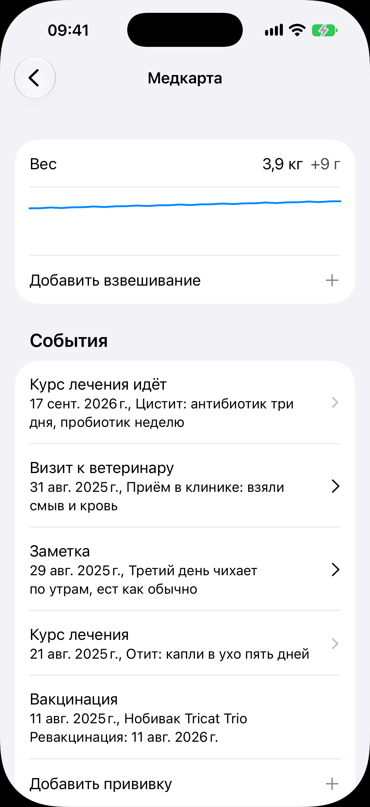

# Медкарта

Код: `MedicalRecordView.swift`, `MedicalRow.swift`, `WeightBlockRows.swift`,
`AnimalHealthEntrySheet.swift`, `AnimalTreatmentSheet.swift`, `AnimalWeighingSheet.swift`.

Кадры этого экрана: `medical-record.png`.

## Что это

Экран медкарты одного животного, открытый переходом с карточки. Сверху блок веса:
последний вес с прибавкой, кривая и строка «Добавить взвешивание». Ниже секция «События»:
лента записей четырёх видов, вид первым словом и подробность второй строкой: «Курс лечения
идёт» (стрелка на экран курса), «Визит к ветеринару», «Заметка», завершённый «Курс лечения»,
«Вакцинация» с датой ревакцинации. Под лентой действия: «Добавить прививку», «Добавить
запись», «Добавить лечение».

## Что делает пользователь

Ведёт здоровье животного: взвешивания, прививки с планом ревакцинации, визиты и заметки,
курсы лечения с препаратами. Обрезанная до двух записей версия той же ленты стоит в секции
«Здоровье» [карточки животного](../animal-card/animal-card.md).

## Откуда открывается

Переход «Медкарта» в секции «Здоровье» [карточки животного](../animal-card/animal-card.md).

## Куда ведёт

- «Курс лечения»: [экран курса](../treatment/treatment.md).
- «Визит к ветеринару», «Заметка», «Вакцинация»: лист записи (правка, вложения, удаление).
- «Добавить взвешивание»: лист взвешивания (граммы или килограммы, дата); тап по весу:
  правка последнего.
- «Добавить прививку»: [форма прививки](../vaccination-form/vaccination-form.md).
- «Добавить запись»: лист записи (вид: визит или заметка, дата, текст, вложения).
- «Добавить лечение»: лист курса (назначение, препараты с интервалом и сроком, вложения).

## Состояния

### Лента из пяти записей

Вес «3,9 кг, +9 г» с кривой, ниже записи всех четырёх видов рядом. Пустая медкарта показала
бы «Записей о здоровье нет» и четыре кнопки добавления.
