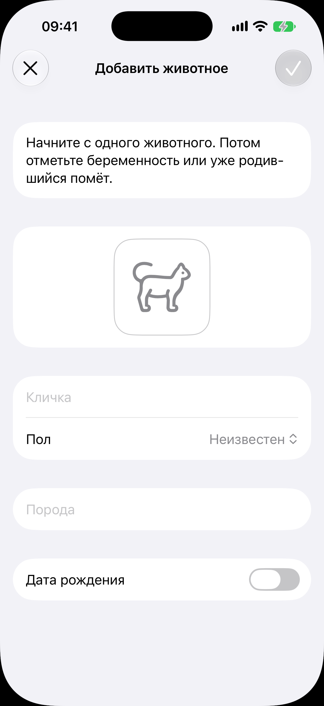
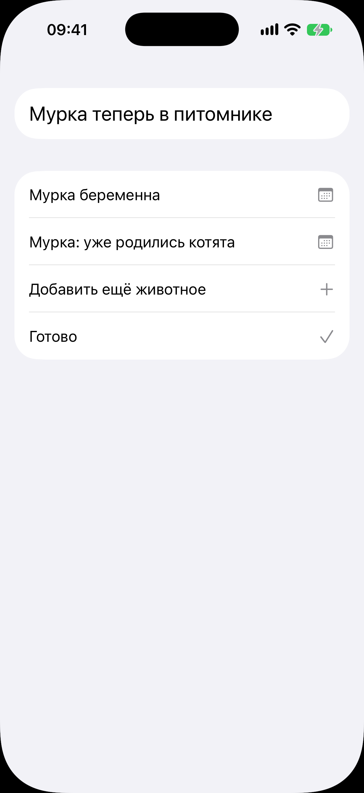
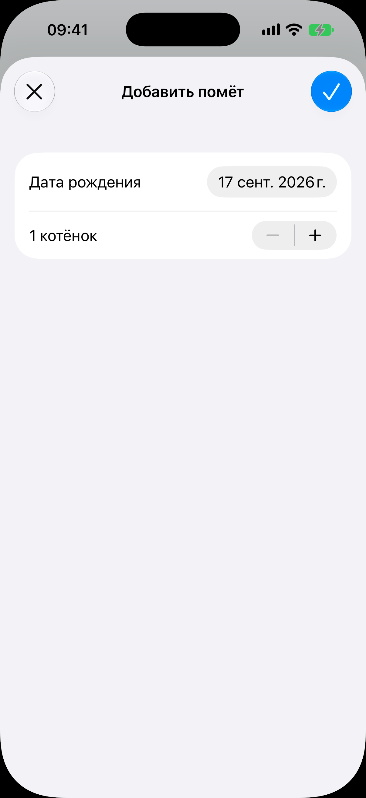
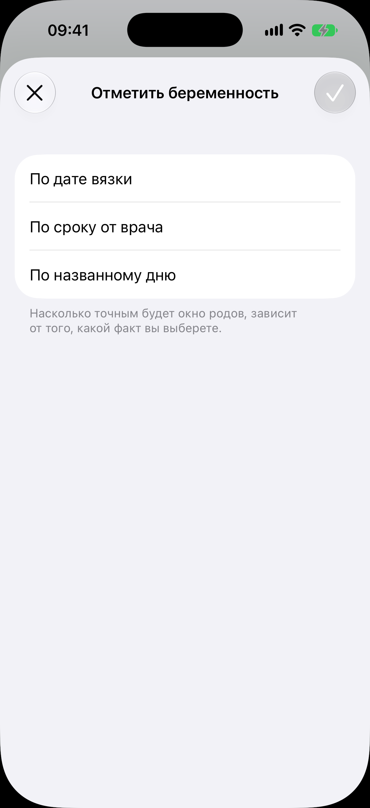

# Флоу первого запуска

Код: `OnboardingView.swift`, `AnimalFormView.swift`, `OnboardingChoiceView.swift`,
`OnboardingLitterView.swift`, `PregnancyAnchorView.swift`.

Кадры: `onboarding-animal.png`, `onboarding-choice.png`, `onboarding-litter.png`,
`onboarding-pregnancy.png`.

## Что это

Флоу самого первого запуска, на весь экран поверх пустого корня. Цель: за пару шагов довести
заводчика до ценности (таймлайн с подсказками или помёт), не заставляя настраивать весь
питомник. Заводчик часто ставит приложение уже на середине беременности и не помнит дату
вязки, поэтому беременность заводится по любому известному якорю.

Шаги:

1. Форма первого животного: та же [форма нового животного](../animal-form/animal-form.md), но над полями
   строка-объяснение «Начните с одного животного. Потом отметьте беременность или уже
   родившийся помёт».
2. Развилка: без шапки, строка «Мурка теперь в питомнике» и четыре действия с кличкой
   заведённого животного: «Мурка беременна», «Мурка: уже родились котята», «Добавить ещё
   животное», «Готово».
3. Одна из веток листом поверх развилки: выбор якоря беременности или форма помёта.

Признак «онбординг закончен» ставит закрытие флоу. Приложение, убитое посреди флоу,
откроет его снова, а заведённое к тому моменту животное уже лежит в списке.

## Что делает пользователь

Заводит первое животное, выбирает, с чего начать, и оказывается на нужном экране.

## Откуда открывается

Самый первый запуск приложения.

## Куда ведёт

- Крестик на форме первого животного: [пустой список животных](../animals/animals.md).
- Галочка на форме: развилка.
- «Мурка беременна»: лист выбора якоря, затем [экран беременности](../pregnancy/pregnancy.md).
- «Уже родились котята»: лист помёта, затем [карточка помёта](../litter/litter.md).
- «Добавить ещё животное»: снова форма животного.
- «Готово»: [список животных](../animals/animals.md).

## Состояния

### Первое животное

Форма «Добавить животное» со строкой-объяснением сверху, крестиком и погашенной галочкой.

### Развилка после первого животного

Четыре действия: «Мурка беременна» и «Мурка: уже родились котята» с календарём, «Добавить
ещё животное» с плюсом, «Готово» с галочкой.

### Помёт уже родился

Лист «Добавить помёт»: «Дата рождения» (сегодня) и число котят со степпером («1 котёнок»).
Котята создаются заготовками без имён.

### Отметить беременность, выбор якоря

Лист «Отметить беременность» с тремя пунктами якоря: «По дате вязки», «По сроку от врача»,
«По названному дню». Тап по пункту раскрывает под ним поле значения. Подпись: «Насколько
точным будет окно родов, зависит от того, какой факт вы выберете». Галочка погашена, пока
пункт не выбран. Тот же лист открывает «Отметить беременность» в
[карточке животного](../animal-card/animal-card.md), а лист «Сменить якорь» на
[экране беременности](../pregnancy/pregnancy.md) выглядит так же, но приходит с выбранным пунктом.
