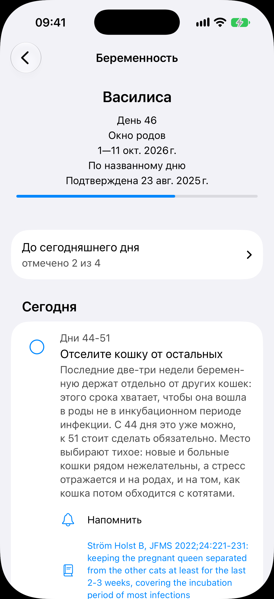
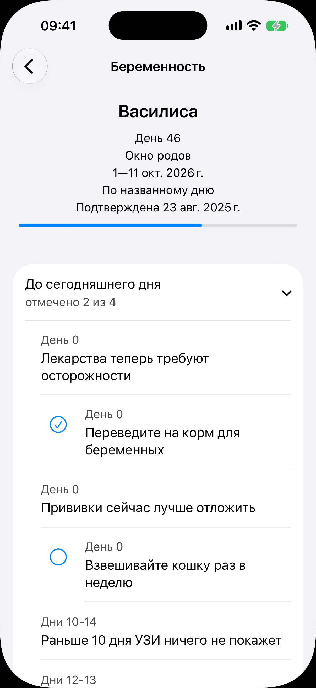
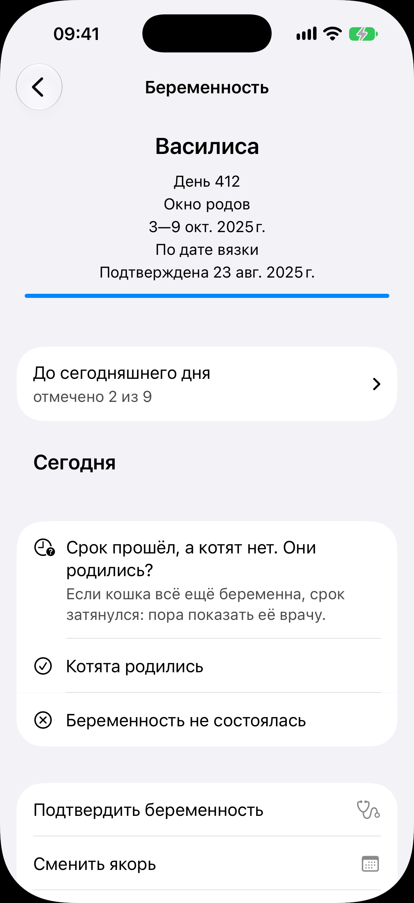
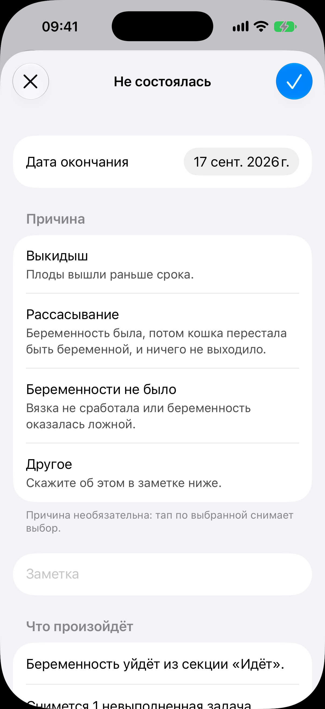

# Беременность

Код: `PregnancyView.swift`, `TimelineFeedSection.swift`, `TimelineRow.swift`,
`PregnancyOutcomeSection.swift`, `PregnancyLossSheet.swift`, `PregnancyConfirmSheet.swift`,
`PregnancyAnchorSheet.swift`, `CitationLink.swift`.

Кадры этого экрана: `pregnancy-timeline.png`, `pregnancy-timeline-past.png`,
`pregnancy.png`, `pregnancy-loss.png`.

## Что это

Экран одной беременности, открытый переходом. Шапка «Беременность» с кнопкой «назад».
Состав сверху вниз:

- заголовочный блок столбиком: кличка, «День N», «Окно родов» и его даты, вид якоря («По
  дате вязки», «По названному дню»), строка подтверждения врачом; под ним полоса прогресса
  срока;
- лента таймлайна из трёх частей: свёрнутое прошлое строкой «До сегодняшнего дня, отмечено
  N из M» (тап раскрывает), заголовок «Сегодня» с раскрытыми сегодняшними пунктами и
  будущее ниже. Пункт: круг отметки слева (у обучающих подсказок круга нет), диапазон дней,
  заголовок рекомендации, текст в несколько абзацев, кнопка «Напомнить» с колокольчиком
  (после нажатия сменяется распиской «Напомним через N дней») и ссылка на источник;
- когда срок ушёл за окно родов, а помёта нет, на месте сегодняшних пунктов стоит вопрос об
  исходе с двумя ответами;
- действия: «Подтвердить беременность», «Сменить якорь», «Открыть роды», «Отметить как
  несостоявшуюся»; если помёт уже есть, вместо «Открыть роды» стоят «Перейти к родам» и
  «Перейти к помёту».

## Что делает пользователь

Следит за сроком и рекомендациями по дням, отмечает сделанное кругом, ставит напоминания
(из них рождаются задачи в ленте «Сегодня»), подтверждает беременность после осмотра,
уточняет якорь, открывает роды в нужный день или отмечает, что беременность не состоялась.

## Откуда открывается

- Строка в секции «Идёт» на вкладке [«Сегодня»](../today/today.md).
- Строка беременности в [карточке самки](../animal-card/animal-card.md) и в
  [истории разведения](../breeding-history/breeding-history.md).
- Сразу после отметки беременности с карточки или из [онбординга](../onboarding/onboarding.md).

## Куда ведёт

- «Котята родились» и «Открыть роды»: [экран родов](../birth/birth.md) на весь экран.
- «Беременность не состоялась» и «Отметить как несостоявшуюся»: лист несостоявшейся
  беременности (ниже).
- «Подтвердить беременность»: лист с датой подтверждения. «Сменить якорь»: лист выбора
  якоря и его даты.
- «Напомнить»: задача в [ленте дел](../today/today.md). Источник: внешняя страница.
- «Перейти к помёту»: [карточка помёта](../litter/litter.md).

## Состояния

### Середина срока, лента со свёрнутым прошлым

«День 46», окно родов впереди, полоса прогресса заполнена наполовину. Прошлое свёрнуто
строкой «отмечено 2 из 4», под «Сегодня» раскрыт пункт «Дни 44-51. Отселите кошку от
остальных» с текстом, кнопкой «Напомнить» и цитатой из источника. Будущее ниже сгиба.

### Раскрытое прошлое

Тот же день, строка «До сегодняшнего дня» раскрыта (стрелка вниз): под ней компактно, без
текстов и кнопок, стоят пройденные пункты. Отмеченные с галочкой в круге («Переведите на
корм для беременных»), неотмеченные с пустым кругом, подсказки без круга. Отмеченное
отличается формой, а не только цветом. При каждом открытии экрана прошлое снова свёрнуто.

### Срок вышел, вопрос об исходе

«День 412»: полоса прогресса заполнена целиком, все пункты ушли в прошлое («отмечено 2 из
9»). Под «Сегодня» вместо пунктов вопрос «Срок прошёл, а котят нет. Они родились?» с
пояснением «Если кошка всё ещё беременна, срок затянулся: пора показать её врачу» и
ответами «Котята родились» и «Беременность не состоялась». Ниже действия «Подтвердить
беременность» и «Сменить якорь».

### Лист несостоявшейся беременности

Лист «Не состоялась» поверх экрана. Поля: «Дата окончания», список причин с пояснениями
(«Выкидыш», «Рассасывание», «Беременности не было», «Другое»; выбор одной, необязателен,
повторный тап снимает), «Заметка». Внизу секция «Что произойдёт» с последствиями до
подтверждения: «Беременность уйдёт из секции „Идёт“», «Снимется 1 невыполненная задача».
После подтверждения экран беременности показывает поля исхода вместо вопроса и действий
(кадра нет).
