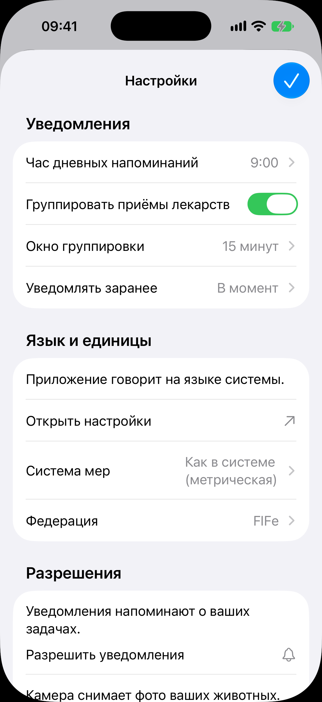
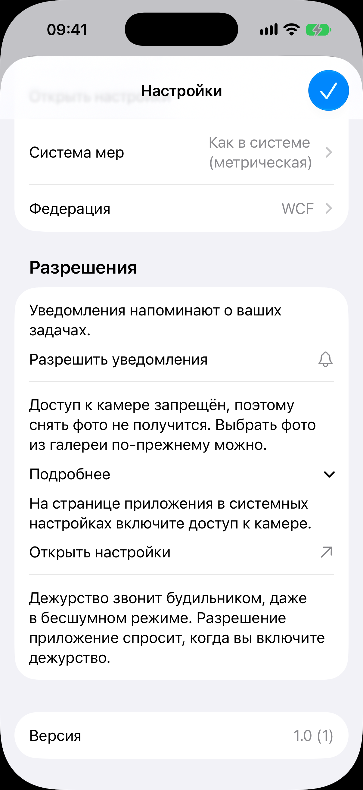

# Настройки

Код: `SettingsView.swift`, `DailyReminderRow.swift`, `NotificationCoalescingRows.swift`,
`MeasurementSystemRow.swift`, `FederationRow.swift`, `NotificationPermissionRow.swift`,
`CameraPermissionRow.swift`, `AlarmPermissionRow.swift`, `PermissionRow.swift`.

Кадры этого экрана: `settings.png`, `settings-federation.png`, `settings-camera-denied.png`.

## Что это

Лист настроек поверх корня; в шапке только галочка «Готово» справа. Три секции и версия:

- «Уведомления»: «Час дневных напоминаний» (пикер времени), переключатель «Группировать
  приёмы лекарств», «Окно группировки», «Уведомлять заранее»;
- «Язык и единицы»: пояснение «Приложение говорит на языке системы» и переход «Открыть
  настройки» в системные; «Система мер» (пикер переходом); «Федерация» (пикер переходом;
  задаёт порог передачи котят и, значит, каким днём кончается лента выращивания);
- «Разрешения»: строки уведомлений, камеры и будильников. Каждая бывает приглашением
  (короткое объяснение и кнопка), запретом (объяснение, раскрывающийся «Подробнее» с шагами
  и переход «Открыть настройки») или, при выданном разрешении, спокойной строкой; будильники
  спрашиваются при включении дежурства, о чём и говорит строка;
- строка «Версия» со сборкой.

## Что делает пользователь

Настраивает час и группировку напоминаний, единицы веса, федерацию, выдаёт разрешения или
уходит в системные настройки, если раньше отказал.

## Откуда открывается

- Шестерёнка в шапке вкладок [«Сегодня»](../today/today.md) и [«Животные»](../animals/animals.md).
- «Настройки уведомлений» на [экране курса лечения](../treatment/treatment.md).

## Куда ведёт

- «Система мер» и «Федерация»: списки выбора переходом внутри листа.
- «Открыть настройки»: системные настройки приложения.
- «Разрешить уведомления»: системный диалог.
- «Готово»: закрывает лист.

## Состояния

### Свежая установка

Час напоминаний 9:00, группировка включена, окно 15 минут, «В момент». Федерация
подставлена по региону (WCF). В «Разрешениях» строка уведомлений приглашением «Разрешить
уведомления», ниже сгиба строка камеры и будильников, потом версия.

### Выбранная федерация

То же, но в строке «Федерация» стоит значение, выбранное заводчиком руками (FIFe), а не
региональное.

### Камера запрещена

Лист прокручен до секции «Разрешения» на устройстве, где доступ к камере запрещён. Строка
камеры в состоянии запрета: «Доступ к камере запрещён, поэтому снять фото не получится.
Выбрать фото из галереи по-прежнему можно», раскрытый блок «Подробнее» с шагом «На
странице приложения в системных настройках включите доступ к камере», переход «Открыть
настройки». Ниже строка будильников и «Версия 1.0 (1)». Такая же строка запрета для
уведомлений показана в [ленте дел](../today/today.md).
