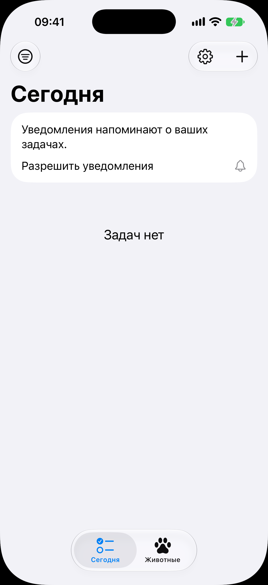
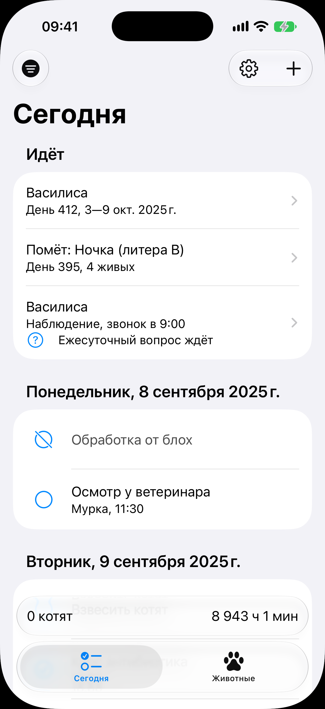
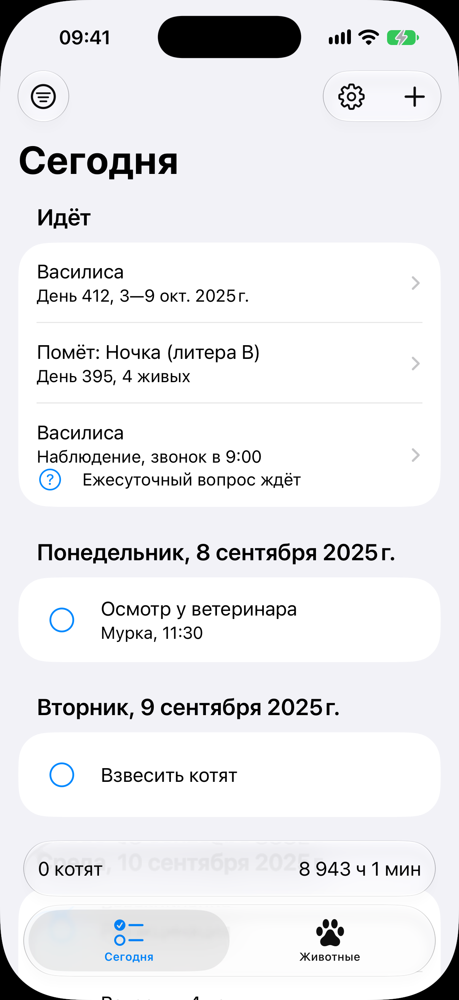
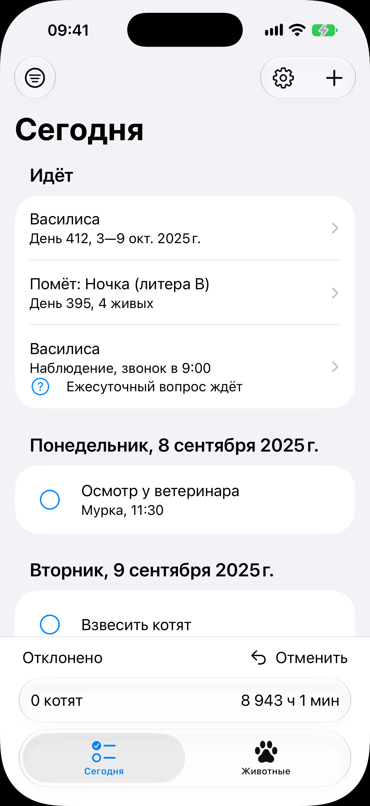
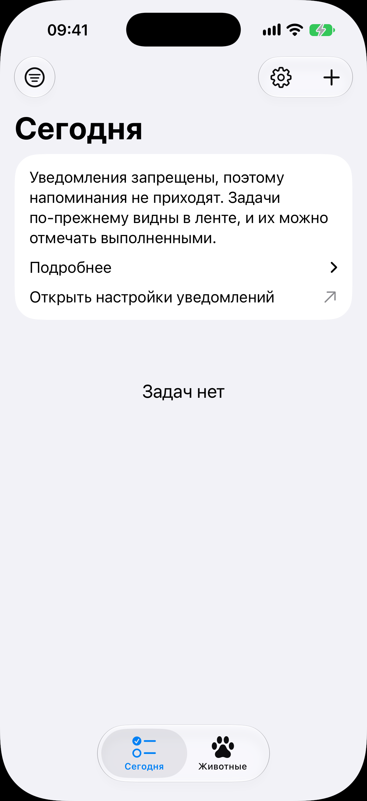

# Вкладка «Сегодня»

Код: `RootView.swift`, `TodayView.swift`, `TodoRow.swift`, `OngoingRow.swift`,
`BirthAccessoryBar.swift`, `NotificationPermissionRow.swift`.

Кадры этого экрана: `root.png`, `today-todos.png`, `today-ongoing.png`, `today-undo.png`,
`today-notifications-denied.png`.

## Что это

Первая вкладка корня и первый экран после холодного запуска: лента дел заводчика по дням.
Шапка: слева кнопка фильтра (меню с двумя переключателями: показывать выполненные,
показывать отклонённые), справа шестерёнка настроек и плюс «Добавить задачу». Крупный
заголовок «Сегодня». Внизу таб-бар с двумя вкладками, «Сегодня» и «Животные».

Состав ленты сверху вниз:

- секция «Идёт»: что в питомнике идёт прямо сейчас (живая беременность, помёт в
  выращивании, дежурство), по строке на процесс со стрелкой перехода; секции нет, если
  идти нечему;
- строка разрешения на уведомления: приглашение, пока не спрошено, объяснение и переход в
  системные настройки, если запрещено; при выданном разрешении строки нет;
- дела, сгруппированные по дням с крупными заголовками дат: у каждого круг слева (тап
  отмечает выполненным), название, кличка животного и время, если оно есть; или надпись
  «Задач нет».

Над таб-баром, пока у какой-то кошки идут роды, стоит полоса родов: слева число котят,
справа время от начала. Она видна на любом экране обеих вкладок и не зависит от ленты.

## Что делает пользователь

- Пробегает день: что сделать сегодня и что просрочено.
- Тап по кругу отмечает дело выполненным; свайп по строке влево открывает «Отклонить». После
  обоих внизу встаёт полоса отмены.
- Тап по тексту дела открывает лист самого дела: название, привязка к животному, дата и
  время, повторение, действия «Отметить выполненным» и «Отменить задачу».
- Тап по строке секции «Идёт» ведёт на её экран; тап по полосе родов открывает роды.
- Плюсом заводит своё дело, шестерёнкой открывает настройки.

## Откуда открывается

- Холодный запуск приложения после пройденного онбординга.
- Тап по уведомлению о деле открывает эту вкладку и лист дела.
- Кнопка «назад» с любого экрана вкладки.

## Куда ведёт

- Полоса родов: [экран родов](../birth/birth.md) на весь экран.
- Строка беременности в «Идёт»: [беременность](../pregnancy/pregnancy.md).
- Строка помёта в «Идёт»: [карточка помёта](../litter/litter.md).
- Строка дежурства в «Идёт»: [дежурство](../duty/duty.md).
- Дело от приёма лекарства: экран «Время приёма» со списком доз этого момента (кадра нет).
- Плюс в шапке: [форма новой задачи](../todo-form/todo-form.md) листом.
- Шестерёнка: [настройки](../settings/settings.md) листом.
- «Открыть настройки уведомлений» в строке запрета: системные настройки приложения.
- Вкладка «Животные»: [список питомника](../animals/animals.md).

## Состояния

### Пустая лента, разрешение не спрошено

Первый запуск после онбординга: питомник только заведён. Первой секцией строка
«Уведомления напоминают о ваших задачах. Разрешить уведомления» с колокольчиком, ниже
пустое место с надписью «Задач нет». Секции «Идёт» и полосы родов нет.

### Лента дел с включённым фильтром

Наполненный питомник. Сверху секция «Идёт» с тремя строками: беременность Василисы (день и
окно родов), помёт Ночки (день выращивания и число живых), дежурство Василисы (вид, час
звонка и пометка «Ежесуточный вопрос ждёт» со значком вопроса). Ниже дни. Фильтр включён,
поэтому первой строкой стоит отклонённое дело «Обработка от блох»: перечёркнутый круг и
приглушённый текст; кнопка фильтра в шапке залита. Дальше обычные дела с кличкой и
временем. Внизу полоса родов «0 котят» и время от начала.

### Секция «Идёт» при выключенном фильтре

Тот же питомник, фильтр выключен: закрытых и отклонённых строк нет, под днями стоит только
запланированное. Предмет кадра: как секция «Идёт» стоит над лентой и сдвигает её.

### Полоса отмены

Сразу после отклонения дела: внизу над полосой родов встала полоса отмены, слева
«Отклонено», справа кнопка «Отменить» со стрелкой назад. Живёт несколько секунд и уходит
сама; она вставлена в низ списка, а не наложена поверх, поэтому последняя строка не
закрывается. После отметки «выполнено» полоса та же, слово другое.

### Уведомления запрещены

Пустая лента на устройстве, где заводчик отказал в уведомлениях. Строка разрешения в
состоянии запрета: объяснение «Уведомления запрещены, поэтому напоминания не приходят.
Задачи по-прежнему видны в ленте, и их можно отмечать выполненными», раскрывающийся пункт
«Подробнее» с шагами и переход «Открыть настройки уведомлений» со стрелкой наружу. Строка
не закрывается, пока запрет действует.
