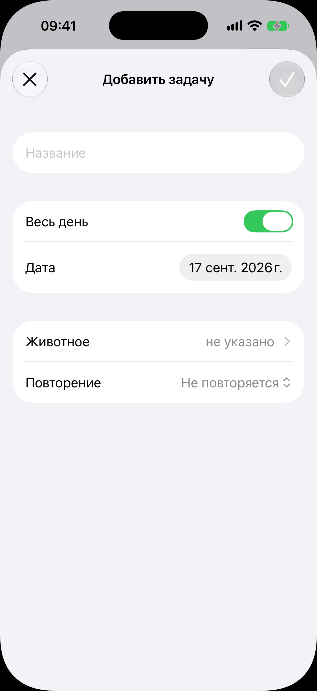

# Форма задачи

Код: `TodoFormView.swift`, `TodoDateRow.swift`, `TodoOccurrenceSheet.swift`.

Кадры этого экрана: `todo-new.png`.

## Что это

Лист заведения своего дела поверх ленты «Сегодня». В шапке крестик «закрыть» слева и
галочка «добавить» справа; галочка погашена, пока название пусто. Поля: «Название»,
переключатель «Весь день» (включён; при выключении ниже появляется строка времени), «Дата»
(по умолчанию сегодня), «Животное» (не указано, переход к выбору из питомника), «Повторение»
(пикер: не повторяется, ежедневно, еженедельно, ежемесячно, ежегодно).

## Что делает пользователь

Заводит дело: название, день или день с временем, привязку к животному, повторение.
Галочка сохраняет и закрывает лист, крестик закрывает без сохранения.

## Откуда открывается

Плюс в шапке [ленты дел](../today/today.md).

## Куда ведёт

- «Животное»: список животных питомника для привязки (внутри листа).
- Закрытие: обратно в [ленту дел](../today/today.md), новая строка встаёт под своим днём.

## Состояния

### Нетронутая форма

Форма сразу после открытия: название пустое, галочка погашена, «Весь день» включён,
строки времени нет.

### Лист заведённого дела (кадра нет)

Тап по делу в ленте открывает тот же набор полей, но заполненный, с заголовком «Задача» и
действиями «Отметить выполненным» и «Отменить задачу» (с подтверждением). Для дел,
рождённых пунктом таймлайна или курсом лечения, часть полей только для чтения.
