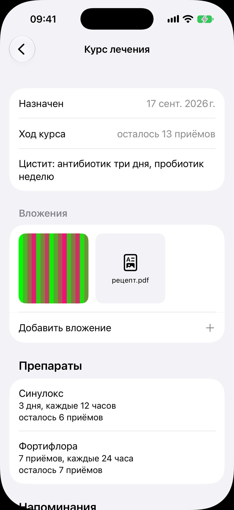

# Курс лечения

Код: `TreatmentCardView.swift`, `AttachmentSection.swift`, `AttachmentTile.swift`,
`TreatmentProgressText.swift`, `MedicationMomentView.swift`.

Кадры этого экрана: `treatment.png`.

## Что это

Экран одного курса лечения, открытый переходом из медкарты или карточки. Сверху блок
назначения: «Назначен» с датой, «Ход курса» («осталось 13 приёмов»), текст назначения.
Секция «Вложения»: плитки приложенных файлов (фото, «рецепт.pdf») и строка «Добавить
вложение» (меню: камера, галерея, файлы). Секция «Препараты»: по строке на препарат с
названием, схемой («3 дня, каждые 12 часов») и остатком приёмов. Ниже сгиба секция
«Напоминания» с пояснением и переходом «Настройки уведомлений», действия «Завершить курс»
и «Редактировать курс».

Приёмы препаратов приходят в [ленту дел](../today/today.md) задачами и уведомлениями; тап по такой
задаче открывает экран «Время приёма» с дозами этого момента (кадра нет).

## Что делает пользователь

Смотрит, докуда дошёл курс и что кончилось, прикладывает рецепт, досрочно завершает курс,
правит назначение.

## Откуда открывается

- Строка курса в [медкарте](../medical-record/medical-record.md).
- Строка курса в секции «Здоровье» [карточки животного](../animal-card/animal-card.md).

## Куда ведёт

- Плитка вложения: просмотр во весь экран.
- «Настройки уведомлений»: [настройки](../settings/settings.md) листом.
- «Завершить курс»: подтверждение, оставшиеся приёмы перестают напоминать.
- «Редактировать курс»: лист курса, тот же, что при добавлении.

## Состояния

### Идущий курс с двумя препаратами и вложениями

Назначение «Цистит: антибиотик три дня, пробиотик неделю», два вложения, препараты
«Синулокс» и «Фортифлора» с остатком приёмов. Завершённый курс показывается без
«Завершить курс» и без остатка приёмов.
