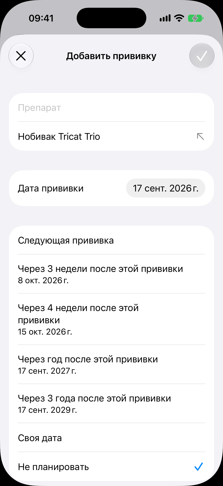

# Форма прививки

Код: `AnimalVaccinationSheet.swift`, `RevaccinationSheet.swift`, `AttachmentDraftSection.swift`.

Кадры этого экрана: `vaccination-new.png`.

## Что это

Лист «Добавить прививку», поднимаемый с медкарты. Галочка погашена, пока препарат пуст.
Поля: «Препарат» с подсказкой ранее введённых названий под полем (стрелка подстановки),
«Дата прививки», секция «Следующая прививка» с пресетами ревакцинации («Через 3 недели после
этой прививки» с датой, «Через 4 недели», «Через год», «Через 3 года», «Своя дата», «Не
планировать» с галочкой по умолчанию). Ниже сгиба секция «Вложения» с одной строкой
«Добавить вложение»: страницу ветпаспорта прикладывают тем же заходом.

## Что делает пользователь

Записывает прививку и сразу планирует следующую: из пресета рождается задача в ленте
«Сегодня» на нужный день. Когда день наступает, задача предлагает записать новую прививку, и
форма приходит с предзаполненным препаратом.

## Откуда открывается

«Добавить прививку» в [медкарте](../medical-record/medical-record.md).

## Куда ведёт

- Галочка: запись встаёт в ленту [медкарты](../medical-record/medical-record.md) со строкой «Ревакцинация:
  дата».
- «Своя дата»: раскрывает выбор даты. «Добавить вложение»: камера, галерея или файлы.

## Состояния

### Нетронутая форма

Препарат пуст, под полем подсказка «Нобивак Tricat Trio», дата на сегодняшнем дне, выбран
пресет «Не планировать».
